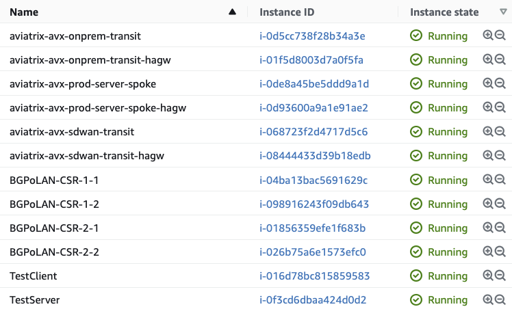

# Aviatrix-BGPoLAN-MP-AWS

This project completely automates a topology for testing BGPoLAN multi-peer in AWS with CSR 1K's simulating SD-WAN head-ends and Aviatrix transits simulating the "on-prem" sd-wan appliances. An SD-WAN transit is created and test spoke with HPE enabled, along with a test client and server. You can prioritize between price or performance by modifying a single variable in the terraform.tfvars, which controls how many test clients/servers are created and the instance sizes. The number of CSRs can also be dynamically scaled via the tfvars and all of the configuration on the CSR's and Aviatrix Gateways is updated automatically.

Copilot view of the Topology:


View of instances created with default settings



BGP Sessions created by the template:


View of S2C External Conns created:


Route list on SDWAN Transits showing ECMP paths towards onprem CIDR:


Validation via traceroute:

```
ubuntu@ip-10-100-0-36:~$ traceroute -n -q5 192.168.0.69
traceroute to 192.168.0.69 (192.168.0.69), 30 hops max, 60 byte packets
 1  10.100.0.168  0.363 ms  0.481 ms  0.459 ms  0.416 ms  0.351 ms
 2  10.1.1.173  0.628 ms 10.1.1.234  1.291 ms 10.1.1.173  1.341 ms 10.1.1.234  1.320 ms 10.1.1.173  0.583 ms
 3  10.1.0.149  0.741 ms  0.762 ms 10.1.0.166  1.280 ms  1.271 ms  1.240 ms
 4  192.168.0.68  1.389 ms 192.168.0.100  1.879 ms 192.168.0.68  1.147 ms 192.168.0.100  1.796 ms  1.783 ms
 5  192.168.0.69  1.973 ms  1.840 ms  1.793 ms  1.828 ms  1.816 ms
```

Ethr pre-installed to do multi-threaded bandwidth testing:

```
On server: ./ethr -s -ui
On client: ./ethr -c <server ip> -n <number of threads>
```


The majority of the work is done by the aviatrix-demo-onprem-aws module: [aviatrix-demo-onprem-aws](https://github.com/gleyfer/aviatrix-demo-onprem-aws) 

**NOTE**: This template utilizes two different CSR1K offers depending on whether prioritize = price or performance. You will need to subscribe the offer depending on your choice.
- CSR BYOL (price): https://aws.amazon.com/marketplace/pp/prodview-tinibseuanup2
- CSR Security Package (performance): https://aws.amazon.com/marketplace/pp/prodview-4mrybq6krrw3g

# Pre-requisites:

- Subscribed to relevant CSR1K offer
- Subscribed to Aviatrix Metered offer or BYOL and [Controller Deployed](https://docs.aviatrix.com/StartUpGuides/aviatrix-cloud-controller-startup-guide.html):
https://aws.amazon.com/marketplace/pp/prodview-leh6ufnwbl6eo
- Sufficient Quotas (Compute, VPC, EIPs)
- Environment variables configured for Aviatrix Terraform Provider: 
https://registry.terraform.io/providers/AviatrixSystems/aviatrix/latest/docs#environment-variables
- (Ideally) aws-cli installed with generated credentials file (aws configure):
https://docs.aws.amazon.com/cli/latest/userguide/getting-started-install.html
https://docs.aws.amazon.com/cli/latest/userguide/cli-configure-quickstart.html

Alternatively, you can edit the providers.tf and directly supply the aws access key and secret.

## Compatibility
Terraform version | Controller version | Terraform provider version
:--- | :--- | :---
1.0+ | 6.5.2608+ | 2.20.2+

# Instructions

Please modify the terraform.tfvars and set appropriate variables relevant to your testing:

- **aws_region:** which region you would like to deploy the resources in
- **account:** which Onboarded AWS account on the Aviatrix Controller will be used to deploy Aviatrix resources
- **sdwan_transit_cidr:** VPC CIDR to used for deploying the SD-WAN/BGPoLAN Aviatrix Transit gateways. Default = 10.1.0.0/23
- **transit_gw_instance_size:** Size of the Aviatrix SD-WAN Transit Gateway instances. Default is c5n.4xlarge (minimum required for BGPoLAN)
- **sdwan_asn:** BGP AS Number for the Aviatrix SD-WAN Transit Gateways. Default = 64373
- **onprem_transit_cidr:** This is the VPC CIDR for the Aviatrix transit which will be used to simulate the "onprem" sdwan appliances. Default = 192.168.0.0/23
- **onprem_asn:** BGP AS Number for the "onprem" Aviatrix Transit gateways. Default = 64528
- **csr_bgp_as_num:** BGP AS Number for the SD-WAN CSR1Ks. Default = 64527
- **csr_pairs:** Number of horizontally scalable CSR Pairs. Default = 2. This field can be tweaked to test ECMP scaling (up to 10).
- **prioritize:** Valid values: "price", "performance".

price: 
- 1 test client/server = t3.micro 
- onprem transit = c5n.large 
- CSRs = t3.medium 
- CSR_AMI = BYOL 
- sdwan transit = c5n.4xlarge 
- spoke = c5n.xlarge

performance:
- 2 test client/server = c5n.4xlarge 
- onprem transit = c5n.4xlarge 
- CSR = c5n.xlarge 
- CSR_AMI = Security Package 
- sdwan transit = c5n.4xlarge 
- spoke = c5n.4xlarge

Once tfvars are set appropriately, or just left at defaults:

- ```terraform init```
- ```terraform plan```
- ```terraform apply --auto-approve```

# Example Outputs

```
BGPoLAN_CSR_SSH_Cmd = [
  [
    "ssh -i BGPoLAN-CSR-1-key.pem ec2-user@44.235.22.219",
    "ssh -i BGPoLAN-CSR-1-key.pem ec2-user@44.230.132.193",
  ],
  [
    "ssh -i BGPoLAN-CSR-2-key.pem ec2-user@52.89.48.15",
    "ssh -i BGPoLAN-CSR-2-key.pem ec2-user@52.10.36.121",
  ],
]
TestClient_PrivateIP = [
  "192.168.0.69",
]
TestClient_SSH_Cmd = [
  "ssh -i BGPoLAN-CSR-1-key.pem ubuntu@54.184.65.137",
]
TestServer_PrivateIP = [
  "10.100.0.36",
]
TestServer_SSH_Cmd = [
  "ssh -i BGPoLAN-CSR-1-key.pem ubuntu@52.37.142.198",
]
```

# Terraform State (Post-Provisioning)

```
data.aws_ami.ubuntu
aws_instance.test_client[0]
aws_instance.test_server[0]
aws_security_group.allow_all_client
aws_security_group.allow_all_server
aws_subnet.BGPoLAN[0]
aws_subnet.BGPoLAN[1]
module.bgpolan_CSR[0].data.aviatrix_transit_gateway.avtx_gateways["avx-onprem-transit"]
module.bgpolan_CSR[0].data.aviatrix_transit_gateway.avtx_gateways["avx-sdwan-transit"]
module.bgpolan_CSR[0].data.aws_ami.csr_aws_ami
module.bgpolan_CSR[0].data.aws_instance.CSROnprem[0]
module.bgpolan_CSR[0].data.aws_instance.CSROnprem[1]
module.bgpolan_CSR[0].data.aws_region.current
module.bgpolan_CSR[0].data.aws_route_table.public_rtb[0]
module.bgpolan_CSR[0].data.aws_route_table.public_rtb[1]
module.bgpolan_CSR[0].data.aws_subnet.bgpolan_subnet[0]
module.bgpolan_CSR[0].data.aws_subnet.bgpolan_subnet[1]
module.bgpolan_CSR[0].data.aws_subnet.public_subnet[0]
module.bgpolan_CSR[0].aviatrix_transit_external_device_conn.privConns["avx-sdwan-transit.1"]
module.bgpolan_CSR[0].aviatrix_transit_external_device_conn.pubConns["avx-onprem-transit.1"]
module.bgpolan_CSR[0].aws_eip.csr_public_eip[0]
module.bgpolan_CSR[0].aws_eip.csr_public_eip[1]
module.bgpolan_CSR[0].aws_instance.CSROnprem[0]
module.bgpolan_CSR[0].aws_instance.CSROnprem[1]
module.bgpolan_CSR[0].aws_key_pair.csr_deploy_key[0]
module.bgpolan_CSR[0].aws_network_interface.CSR_BGPOLAN_ENI[0]
module.bgpolan_CSR[0].aws_network_interface.CSR_BGPOLAN_ENI[1]
module.bgpolan_CSR[0].aws_network_interface.CSR_Public_ENI[0]
module.bgpolan_CSR[0].aws_network_interface.CSR_Public_ENI[1]
module.bgpolan_CSR[0].aws_network_interface_attachment.bgpolan_attachment[0]
module.bgpolan_CSR[0].aws_network_interface_attachment.bgpolan_attachment[1]
module.bgpolan_CSR[0].aws_security_group.csr_private_sg
module.bgpolan_CSR[0].aws_security_group.csr_public_sg
module.bgpolan_CSR[0].aws_security_group_rule.csr_private_egress
module.bgpolan_CSR[0].aws_security_group_rule.csr_private_ingress
module.bgpolan_CSR[0].aws_security_group_rule.csr_public_dhcp
module.bgpolan_CSR[0].aws_security_group_rule.csr_public_egress
module.bgpolan_CSR[0].aws_security_group_rule.csr_public_esp
module.bgpolan_CSR[0].aws_security_group_rule.csr_public_ipsec
module.bgpolan_CSR[0].aws_security_group_rule.csr_public_ntp
module.bgpolan_CSR[0].aws_security_group_rule.csr_public_snmp
module.bgpolan_CSR[0].aws_security_group_rule.csr_public_ssh
module.bgpolan_CSR[0].local_file.private_key[0]
module.bgpolan_CSR[0].tls_private_key.csr_deploy_key[0]
module.bgpolan_CSR[1].data.aviatrix_transit_gateway.avtx_gateways["avx-onprem-transit"]
module.bgpolan_CSR[1].data.aviatrix_transit_gateway.avtx_gateways["avx-sdwan-transit"]
module.bgpolan_CSR[1].data.aws_ami.csr_aws_ami
module.bgpolan_CSR[1].data.aws_instance.CSROnprem[0]
module.bgpolan_CSR[1].data.aws_instance.CSROnprem[1]
module.bgpolan_CSR[1].data.aws_region.current
module.bgpolan_CSR[1].data.aws_route_table.public_rtb[0]
module.bgpolan_CSR[1].data.aws_route_table.public_rtb[1]
module.bgpolan_CSR[1].data.aws_subnet.bgpolan_subnet[0]
module.bgpolan_CSR[1].data.aws_subnet.bgpolan_subnet[1]
module.bgpolan_CSR[1].data.aws_subnet.public_subnet[0]
module.bgpolan_CSR[1].aviatrix_transit_external_device_conn.privConns["avx-sdwan-transit.1"]
module.bgpolan_CSR[1].aviatrix_transit_external_device_conn.pubConns["avx-onprem-transit.1"]
module.bgpolan_CSR[1].aws_eip.csr_public_eip[0]
module.bgpolan_CSR[1].aws_eip.csr_public_eip[1]
module.bgpolan_CSR[1].aws_instance.CSROnprem[0]
module.bgpolan_CSR[1].aws_instance.CSROnprem[1]
module.bgpolan_CSR[1].aws_key_pair.csr_deploy_key[0]
module.bgpolan_CSR[1].aws_network_interface.CSR_BGPOLAN_ENI[0]
module.bgpolan_CSR[1].aws_network_interface.CSR_BGPOLAN_ENI[1]
module.bgpolan_CSR[1].aws_network_interface.CSR_Public_ENI[0]
module.bgpolan_CSR[1].aws_network_interface.CSR_Public_ENI[1]
module.bgpolan_CSR[1].aws_network_interface_attachment.bgpolan_attachment[0]
module.bgpolan_CSR[1].aws_network_interface_attachment.bgpolan_attachment[1]
module.bgpolan_CSR[1].aws_security_group.csr_private_sg
module.bgpolan_CSR[1].aws_security_group.csr_public_sg
module.bgpolan_CSR[1].aws_security_group_rule.csr_private_egress
module.bgpolan_CSR[1].aws_security_group_rule.csr_private_ingress
module.bgpolan_CSR[1].aws_security_group_rule.csr_public_dhcp
module.bgpolan_CSR[1].aws_security_group_rule.csr_public_egress
module.bgpolan_CSR[1].aws_security_group_rule.csr_public_esp
module.bgpolan_CSR[1].aws_security_group_rule.csr_public_ipsec
module.bgpolan_CSR[1].aws_security_group_rule.csr_public_ntp
module.bgpolan_CSR[1].aws_security_group_rule.csr_public_snmp
module.bgpolan_CSR[1].aws_security_group_rule.csr_public_ssh
module.bgpolan_CSR[1].local_file.private_key[0]
module.bgpolan_CSR[1].tls_private_key.csr_deploy_key[0]
module.onprem_transit.aviatrix_transit_gateway.default
module.onprem_transit.aviatrix_vpc.default
module.sdwan_transit.aviatrix_transit_gateway.default
module.sdwan_transit.aviatrix_vpc.default
module.test_spoke.aviatrix_spoke_gateway.default
module.test_spoke.aviatrix_spoke_transit_attachment.default[0]
module.test_spoke.aviatrix_vpc.default[0]
```
